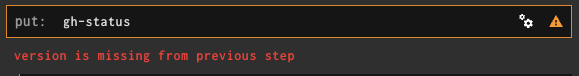

# Contributing and developing

Contributions following the minimalist spirit of this project are welcome.

**Please, before opening a PR, open a ticket to discuss your use case**.

This allows to better understand the _why_ of a new feature and not to waste your time (and ours) developing a feature that for some reason doesn't fit well with the spirit of the project or could be implemented differently.
This is in the spirit of [Talk, then code](https://dave.cheney.net/2019/02/18/talk-then-code).

We care about code quality, readability and tests, so please follow the current style and provide adequate test coverage.
In case of doubts about how to tackle testing something, feel free to ask.

# Development Prerequisites

## Required

* Go, version >= 1.20
* Docker, version >= 20
* [Task], version >= 3.27

## Optional

* [gopass] to securely store secrets for integration tests.

# Using Task (replacement of make)

Have a look at the [task documentation][Task], then run:

```
$ task --list
```

# Running the default tests

The Taskfile includes a `test:unit` target, and tests are also run inside the Docker build.

Run the default tests:

```
$ task test:unit
```

# Integration and acceptance tests

There are the following integration tests:

* tests upon GitHub
* tests upon Google Chat
* tests upon the Docker image as resource inside Concourse

We require environment variables to pass test configuration. The reason is twofold:

* To enable any contributor to run their own tests without having to edit any file.
* To securely store secrets!

The following sections contain first instructions for the setup, then instructions on how to run the tests.

## Secure handling of secrets

We use the [gopass] tool, that stores secrets in the file system using GPG. We then make the secrets available as environment variables in the [Taskfile.yml](Taskfile.yml).

## Concourse URL

This is used in the acceptance tests.

```console
$ gopass insert cogito/concourse_url
```

## Integration tests upon GitHub

The integration tests (tests that interact with GitHub) are disabled by default because they require some out of band setup, explained below.

### Default test repository

* https://github.com/Pix4D/cogito-test-read-write

### Add the GitHub OAuth token

```console
$ gopass insert cogito/test_oauth_token
```

### Prepare the test repository

1. In your GitHub account, create a test repository, say for example `cogito-test`.
2. In the test repository, push at least one commit, on any branch you fancy. Take note of the 40 digits commit SHA (the API wants the full SHA).

### Add test repository information as environment variables

```console
$ gopass insert cogito/test_repo_owner # Your GitHub user or organization
$ gopass insert cogito/test_repo_name  # The repo name (without the trailing .git)
$ gopass insert cogito/test_commit_sha
```

## Secure handling of the DockerHub token

**NOTE**: You need to follow this section only if you want to fork this repository; if you only want to provide a PR you don't strictly need this part (although in this case you will have to push by hand the docker image to use in your tests, so maybe it is time well spent anyway :-).

Do not use your DockerHub password, instead create a dedicated access token, see documentation at [dockerhub access tokens](https://docs.docker.com/docker-hub/access-tokens/). This allows to:

1. Reduce exposure (principle of least privilege), since a token has fewer capabilities than an account password.
2. Enable auditing of token usage.
3. Enable token revocation.

Unfortunately it is not possible to limit the scope of a token to a given image repository: a token has access to all repositories of an account. Nonetheless, it still makes sense to use a separate token per image repository, since it enables better auditing.

Login to your account and go to Settings | Security. Create a token, give it a name such as `CI Project Cogito` and securely back it up in your OS key store.

From an API point of view, the token can be used with `docker login` as if it was a password.

Add the GitHub configuration:

```console
$ gopass insert cogito/docker_username
$ gopass insert cogito/docker_org
$ gopass insert cogito/docker_token
```

## Add Google Chat webhook

Pix4D team member: see Google chat spaces "cogito-test" and "cogito-test-2", which are already configured.

If you are not using this feature, just add an empty string. This will allow to use the sample pipeline cogito.yml without modification.

```console
$ gopass insert cogito/test_gchat_webhook
```

### Verify your setup

```console
$ gopass ls cogito
```

should show:

```text
cogito/
├── docker_org
├── docker_token
├── docker_username
├── test_gchat_webhook
├── test_commit_sha
├── test_oauth_token
├── test_repo_name
└── test_repo_owner
```

## Running the integration tests

We are finally ready to run the integration tests:

```
$ task test:all
```

The integration tests have the following logic:

* If none of the environment variables are set, we skip the test.
* If all the environment variables are set, we run the test.
* If some environment variables are set and some not, we fail the test. We do this on purpose to signal to the user that the environment variables are misconfigured.

## Running a specific end-to-end test

Use the `test:env` task target, that runs a shell with the secrets needed for the integration tests available as environment variables.

Run all the subtests of a table-driven test:

```
$ task test:env -- go test ./github -count=1 -run 'TestGitHubStatusFailureIntegration'
```

Run an individual subtest of a table-driven test:

```
$ task test:env -- go test ./github -count=1 -run 'TestGitHubStatusFailureIntegration/non_existing_SHA:_Unprocessable_Entity'
```

# Building and publishing the image

The Taskfile includes targets for building and publishing the docker image.

## All-in-one, using the same script as CI

**WARNING**: If you are working on a commit that has a tag, using the CI script will also have an effect on the published Docker image tag. Double-check what you are doing.

## Step-by-step

Simply have a look at the contents of [.github/workflows/ci.yml](.github/workflows/ci.yml) and run each step there manually.

Run the tests

```console
$ task test:all
```

Build the Docker image

```console
$ task docker:build
```

Run simple smoke test of the image

```console
$ task docker:smoke
```

Push the Docker image. This will always generate a Docker image with a tag corresponding to the branch name. If the tip of the branch has a git tag (for example `v1.2.3`), this will also generate a Docker image with that tag (for example `1.2.3`).

```console
$ task docker:push
```

Handy shortcut (will stop on first error)

```console
$ task test:all docker:build docker:smoke docker:push
```

# Integration tests: test the Docker image as resource inside Concourse

Have a look at the sample pipeline in [pipelines/cogito.yml](pipelines/cogito.yml).

You can use my other project [concourse-in-a-box](https://github.com/marco-m/concourse-in-a-box), an all-in-one Concourse CI/CD system based on Docker Compose, with Minio S3-compatible storage and HashiCorp Vault secret manager, to easily test the cogito image.

See also the next section.

## Quick iterations during development

These suggestions apply to the development of any Concourse resource.

### Building a new image and ensuring that the pipeline picks it up 

After the local tests are passing, the quickest way to test in a pipeline the freshly pushed version of the Docker image used to be the `fly check-resource-type` command. Unfortunately somewhere in the Concourse 7.6.x series this broke (details: [registry-image-resource #316](https://github.com/concourse/registry-image-resource/issues/316)).

#### Using fly clear-version

Since Concourse 7.8.0, the new fly command [`clear-versions`](https://github.com/concourse/concourse/pull/8196), can be used as a workaround.

Note that the workaround doesn't always succeed (especially if you have `--enable-global-resources
` for Concourse web). In this case, follow the next section [Issuing a new tag for the Docker image](#issuing-a-new-tag-for-the-Docker-image).

You can follow two steps:

1. `fly set-pipeline` with a check_interval for the resource type of 1m instead of the recommended 24h.
2. `fly clear-version`.

For example, assuming that the test pipeline is called `cogito-test`, that the resource in the pipeline is called `cogito` and that there is a job called `motormouse` (all this is true by using the sample pipeline [pipelines/cogito.yml](./pipelines/cogito.yml)), 

Step 1:

```
$ fly -t cogito set-pipeline -p cogito-test -c pipelines/cogito.yml \
  -y branch=stable \
  -y github-owner=(gopass show cogito/test_repo_owner) \
  -y repo-name=(gopass show cogito/test_repo_name) \
  -y oauth-personal-access-token=(gopass show cogito/test_oauth_token) \
  -y cogito-tag=(git branch --show-current) \
  -y cogito-image-check_every=1m \
  -y gchat_webhook=(gopass show cogito/test_gchat_webhook)
```

Step 2 (the sleep is fundamental to let check_every expire):

```
$ task test:all docker:build docker:smoke docker:push &&
  fly -t cogito clear-versions --resource-type=cogito-test/cogito &&
  echo "sleeping and hoping :-(" && 
  sleep 70 &&
  fly -t cogito trigger-job -j cogito-test/motormouse -w
```

#### Issuing a new tag for the Docker image

If you are stuck on a Concourse release < 7.8.0 or `fly clear-versions` is not effective, a guaranteed workaround :-) is to issue a new tag for the Docker image. Following the suggested workflow, this is achieved by renaming the branch, building a new Docker image and re-setting the pipeline. If you follow this path, the check_interval can stay at 24h.

### Validating which version of cogito a pipeline build is using

On each `check`, `put` and `get` step, the cogito resource will print its version, git commit SHA and build date to help validate which version a given build is using:

```text
This is the Cogito GitHub status resource. Tag: latest, commit: 91f64c0, date: 2019-10-09
```

## Testing instanced vars

(Instanced vars)[https://concourse-ci.org/instanced-pipelines.html] is a feature introduced in Concourse 7.4 to group together pipelines generated from the same pipeline configuration file.

With reference to the sample pipeline in [pipelines/cogito.yml](pipelines/cogito.yml), you can use the `((branch))` variable as an instanced var:

Pipeline instance 1:

```
$ fly -t cogito set-pipeline -p cogito-test -c pipelines/cogito.yml \
  -y github-owner=(gopass show cogito/test_repo_owner) \
  -y repo-name=(gopass show cogito/test_repo_name) \
  -y oauth-personal-access-token=(gopass show cogito/test_oauth_token) \
  -y cogito-tag=(git branch --show-current) \
  -y cogito-image-check_every=24h \
  --instance-var branch=stable
```

Pipeline instance 2:

```
$ fly -t cogito set-pipeline -p cogito-test -c pipelines/cogito.yml \
  -y github-owner=(gopass show cogito/test_repo_owner) \
  -y repo-name=(gopass show cogito/test_repo_name) \
  -y oauth-personal-access-token=(gopass show cogito/test_oauth_token) \
  -y cogito-tag=(git branch --show-current) \
  -y cogito-image-check_every=24h \
  --instance-var branch=another-branch
```

## Refreshing the resource image when using instanced vars

```
$ task docker:build docker:smoke docker:push &&
    fly -t cogito check-resource-type -r cogito-test/branch:stable/cogito &&
    fly -t cogito check-resource-type -r cogito-test/branch:another-branch/cogito
```

## Solving Concourse error: version is missing from previous step



If you get the confusing `version is missing from previous step` error in cogito put, while using a pipeline like `cogito.yml` that uses as Docker tag the name of the branch, it simply means that you forgot to push for the first time the cogito Docker image.

# Setting up GitHub Action CI

Update the expired secrets as follows.

## Regenerate your GitHub personal access token (PAT)

1. Go to [Settings | Tokens](https://github.com/settings/tokens) for your account.
2. Create or regenerate a token with name `test-cogito`, with scope "repo:status". Set an expiration of 90 days.
3. Copy the token.

## Regenerate a Google Chat hook

1. Go to the space
2. Click on Manage webhook
3. Add or update the webhook, copy it

## Update the CI secrets

- Go to [Settings | Secrets | Actions](https://github.com/Pix4D/cogito/settings/secrets/actions)
- Click on Update for secret `COGITO_TEST_OAUTH_TOKEN`.
    - Paste the GitHub PAT you generated in the previous section.
- Click on Update for secret `COGITO_TEST_GCHAT_HOOK`.
    - Paste the ghcat webhook you generated in the previous section.

## Check that it works

Trigger a manual run of the CI to verify that everything works fine.

## Preparing a PR

Run the acceptance tests:

```
$ task test:acceptance
```

# Making a release

A release is performed by the GitHub Action CI, triggered by a git tag of the form `v1.2.3`.

- When making a release, it pays to also perform the manual tests in section [Quick iterations during development](#quick-iterations-during-development).
- Run the acceptance tests (`task test:acceptance`).
- Prepare the PR to also contain an updated CHANGELOG.
- Merge the PR to master.
- git checkout master && git pull
- Create and then push a git tag (git tag -a -m '' v0.8.0 && git push origin v0.8.0)
- Double-check that the GitHub Action CI issues the release and that the new image appeared on [dockerhub](https://hub.docker.com/repository/docker/pix4d/cogito).

# License

This code is licensed according to the MIT license (see file [LICENSE](./LICENSE)).


[Task]: https://taskfile.dev/
[gopass]: https://github.com/gopasspw/gopass
