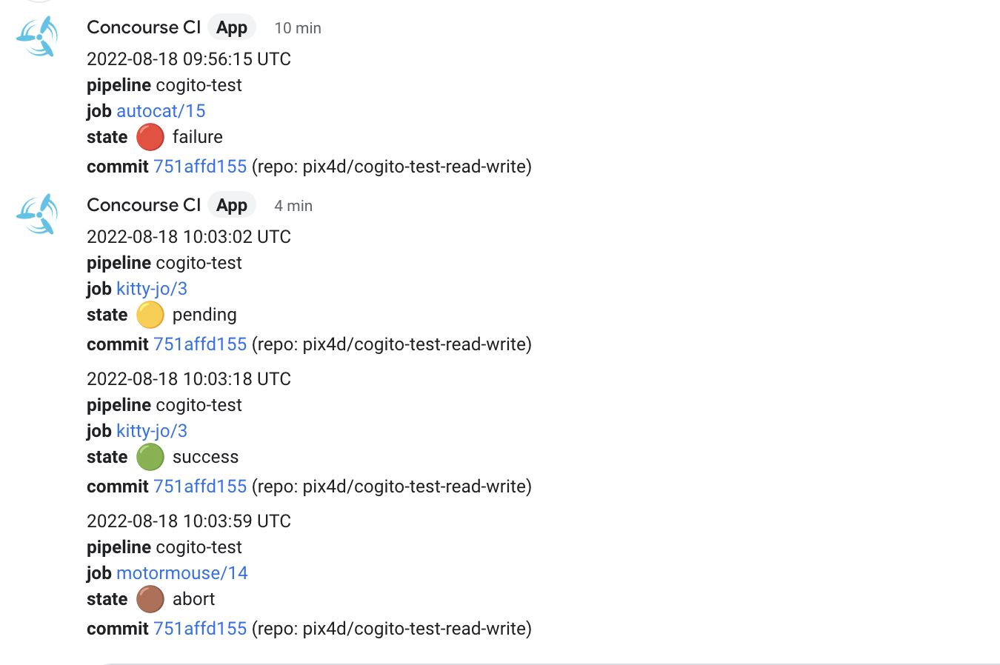

# cogito

Cogito (**CO**ncourse **GIT** status res**O**urce) is a [Concourse resource] to update the GitHub commit status during a build. The name is a humble homage to [René Descartes].

Optionally, it also sends a message to a chat system (currently supported: Google Chat). This allows to reduce the verbosity of a Concourse pipeline and especially to reduce the number of resource containers in a Concourse deployment, thus reducing load.

Written in Go, it has the following characteristics:

- As lightweight as possible (Docker Alpine image).
- Extensive test suite.
- Autodiscovery of configuration parameters.
- No assumptions on the git repository (for example, doesn't assume that the default branch is `main` or that branch `main` even exists).
- Supports Concourse 7.4 [instanced pipelines](https://concourse-ci.org/instanced-pipelines.html).
- Helpful error messages when something goes wrong with the GitHub API.
- Configurable logging for the three steps (check, in, out) to help troubleshooting.
- Boilerplate code generated with [ofcourse](https://github.com/cloudboss/ofcourse).

[Concourse resource]: https://concourse-ci.org/resources.html
[René Descartes]: https://en.wikipedia.org/wiki/Ren%C3%A9_Descartes

# Contributing and Development

This document explains how to use this resource. See [CONTRIBUTING](./CONTRIBUTING.md) for how to build the Docker image, develop, test and contribute to this resource.

**Please, before opening a PR, open a ticket to discuss your use case**.
This allows to better understand the _why_ of a new feature and not to waste your time (and ours) developing a feature that for some reason doesn't fit well with the spirit of the project or could be implemented differently.
This is in the spirit of [Talk, then code](https://dave.cheney.net/2019/02/18/talk-then-code).

We care about code quality, readability and tests, so please follow the current style and provide adequate test coverage.
In case of doubts about how to tackle testing something, feel free to ask.

# Semver, releases and Docker images

This project follows [Semantic Versioning](https://semver.org/) and has a [CHANGELOG](./CHANGELOG).

**NOTE** Following semver, no backwards compatibility is guaranteed as long as the major version is 0.

Releases are tagged in the git repository with the semver format `vMAJOR.MINOR.PATCH` (note the `v` prefix). The corresponding Docker image has tag `MAJOR.MINOR.PATCH` and is available from [DockerHub](https://hub.docker.com/r/pix4d/cogito).

## Which Docker tag to use?

- The `latest` tag always points to the  latest release, not to the tip of master, so it is quite stable.
- Alternatively, you can pin the resource to a specific release tag `MAJOR.MINOR.PATCH`.

# Examples

## Only GitHub commit status

See also [pipelines/cogito.yml](pipelines/cogito.yml) for a bigger example and for how to use YAML anchors to reduce as much as possible YAML verbosity.

```yaml
resource_types:
- name: cogito
  type: registry-image
  check_every: 24h
  source:
    repository: pix4d/cogito

resources:
- name: gh-status
  type: cogito
  check_every: 24h
  source:
    owner: ((github-owner))
    repo: ((your-repo-name))
    access_token: ((github-PAT))

- name: the-repo
  type: git
  source:
    uri: https://github.com/((github-owner))/((your-repo-name))
    branch: ((branch))

jobs:
  - name: autocat
    on_success:
      put: gh-status
      inputs: [the-repo]
      params: {state: success}
    on_failure:
      put: gh-status
      inputs: [the-repo]
      params: {state: failure}
    on_error:
      put: gh-status
      inputs: [the-repo]
      params: {state: error}
    on_abort:
      put: gh-status
      inputs: [repo.git]
      params: {state: abort}
    plan:
      - get: the-repo
        trigger: true
      - put: gh-status
        inputs: [the-repo]
        params: {state: pending}
      - task: maybe-fail
        config:
          platform: linux
          image_resource:
            type: registry-image
            source: { repository: alpine }
          run:
            path: /bin/sh
            args:
              - -c
              - |
                set -o errexit
                echo "Hello world!"
```

## GitHub commit status plus chat notification

The absolute minimum is adding key `gchat_webhook` to the `source` configuration of the previous example:

```yaml
- name: gh-status
  type: cogito
  check_every: 24h
  source:
    owner: ((github-owner))
    repo: ((your-repo-name))
    access_token: ((github-PAT))
    gchat_webhook: ((gchat_webhook))
```

# Effects

## Build states mapping

There is only a partial matching between Concourse and GitHub Commit status API, so we map as good as we can according to this table: 

| Concourse<br/> State | Color and meaning                                                                                         | GitHub<br/> Commit status API | Chat notification |
|----------------------|-----------------------------------------------------------------------------------------------------------|-------------------------------|-------------------|
| running              | 🟡 - running                                                                                              | pending                       | pending           |
| success              | 🟢 - task exited 0                                                                                        | success                       | success           |
| failure              | 🔴 - task exited non 0                                                                                    | failure                       | failure           |
| error                | 🟠 - any other error besides failure or abort (pipeline configuration error, network error, timeout, ...) | error                         | error             |
| abort                | 🟤 - human-initiated abort                                                                                | error                         | abort             |

The colors are taken from the Concourse UI and are replicated to the chat message.

## Effects on GitHub

With reference to the [GitHub Commit status API], the `POST` parameters (`state`, `target_url`, `description`, `context`) are set by Cogito and rendered by GitHub as follows:


## Effects on Google Chat

- Create a Gchat space per pipeline or per group of related pipelines.
- At space creation time (cannot be changed afterwards) select threaded messages.
- In the upper left, click on the drop-down menu with the name of the space.
- Click on Manage webhooks.
- Create a webhook and securely store it in your Concourse secret management system.



# Source Configuration

## Required keys

- `owner`: The GitHub user or organization.
- `repo`: The GitHub repository name.
- `access_token`: The OAuth access token. See section [GitHub OAuth token](#github-oauth-token).

## Optional keys

- `context_prefix`: The prefix for the GitHub Commit status API "context" (see section [Effects on GitHub](#effects-on-github)). If present, the context will be `context_prefix/job_name`. Default: empty. See also the optional `context` in the [put step](#the-put-step).
- `gchat_webhook`. Default: empty. URL of a [Google Chat webhook].
    A notification about the build status will be sent to the associated chat channel, using a thread key composed by the pipeline name and commit hash.
    By default, the build statuses that will trigger a notification are `abort`, `error` and `failure`. 
    See section [Effects on Google Chat](#effects-on-google-chat) (since v0.7.0).
- `log_level`: The log level (one of `debug`, `info`, `warn`, `error`, `silent`). Default: `info`.
- `log_url`. **DEPRECATED, no-op, will be removed** A Google Hangout Chat webhook. Useful to obtain logging for the `check` step for Concourse < 7.

## Suggestions

We suggest to set a long interval for `check_interval`, for example 24 hours, as shown in the example above. This helps to reduce the number of check containers in a busy Concourse deployment and, for this resource, has no adverse effects.

# The check step

No-op. Will always return the same version, `dummy`.

# The get step

No-op.

# The put step

Sets the GitHub commit status for a given commit, following the [GitHub Commit status API].
The same commit can have multiple statuses, differentiated by parameter `context`.

If the `source` block has the optional key `gchat_webhook`, then it will also send a message to the configured chat space, based on the `state` parameter.

## Required params

- `state`: The state to set. One of `error`, `failure`, `pending`, `success`, `abort`. Subject to the mapping explained in section [Effects](#effects).

## Optional params

- `context`: The value of the non-prefix part of the GitHub Commit status API "context" (see section [Effects on GitHub](#effects-on-github)). Default: the job name. See also the optional `context_prefix` in the [source configuration](#source-configuration).

## Note

The put step requires one and only one ["put inputs"] to be specified, otherwise it will error out. For example:

```yaml
on_success:
  put: gh-status
  # This is the name of the git resource corresponding to the GitHub repo to be updated.
  inputs: [the-repo]
  params: {state: success}
```

As all the other GitHub commit status resources, it requires as input the git repo passed by the git resource because it will look inside it to gather information such as the commit hash for which to set the commit status.

It requires only one put input to help you have an efficient pipeline, since if the "put inputs" list is not set explicitly, Concourse will stream all inputs used by the job to this resource, which can have a big performance impact. From the ["put inputs"] documentation:

> inputs: [string]
>
> Optional. If specified, only the listed artifacts will be provided to the container. If not specified, all artifacts will be provided.

To better understand from where `the-repo` comes from, see the full example at the beginning of this document.

["put inputs"]: https://concourse-ci.org/put-step.html#put-step-inputs

# GitHub OAuth token

Follow the instructions at [GitHub personal access token] to create a personal access token.

Give to it the absolute minimum permissions to get the job done. This resource only needs the `repo:status` scope, as explained at [GitHub Commit status API].

NOTE: The token is security-sensitive. Treat it as you would treat a password. Do not encode it in the pipeline YAML and do not store it in a YAML file. Use one of the Concourse-supported credentials managers, see [Concourse credential managers].

See also the section [Integration tests](./CONTRIBUTING.md#integration-tests) for how to securely store the token to run the end-to-end tests.

# Caveat: GitHub rate limiting

From [GitHub REST API]:

> Rate limiting
>
> For API requests using Basic Authentication or OAuth, you can make up to 5000 requests
> per hour. All OAuth applications authorized by a user share the same quota of 5000
> requests per hour when they authenticate with different tokens owned by the same user.
>
> For unauthenticated requests, the rate limit allows for up to 60 requests per hour.
> Unauthenticated requests are associated with the originating IP address, and not the
> user making requests.

In case of rate limiting, the error message in the output of the `put` step will mention it.

# License

This code is licensed according to the MIT license (see file [LICENSE](./LICENSE)).

[GitHub Commit status API]: https://docs.github.com/en/rest/commits/statuses
[GitHub REST API]: https://docs.github.com/en/rest
[GitHub personal access token]: https://help.github.com/en/articles/creating-a-personal-access-token-for-the-command-line

[Concourse credential managers]: https://concourse-ci.org/creds.html.

[Google Chat webhook]: https://developers.google.com/chat/how-tos/webhooks
